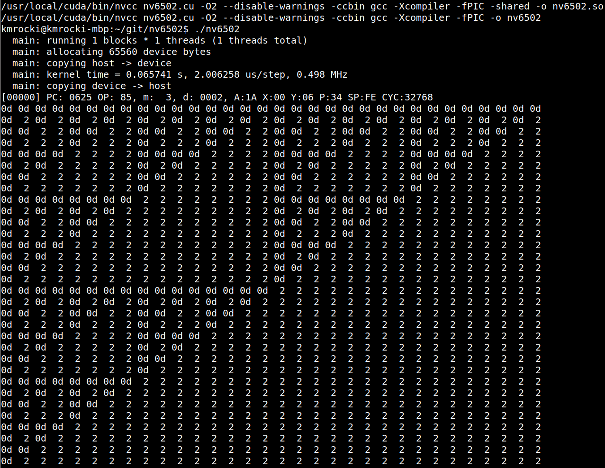

# nv6502
A 6502 CPU emulator which runs on GPU cores in under 200 lines of code



This is source code for a very short (66B) program which generates this pattern in about 32k cycles (here: one cycle = one executed instruction)

```
; Sierpinski-like triangles

start:
  ldx #0
  lda #$00
  sta $0
  lda #$02
  sta $1
write:
  jsr point
  sta ($0,x)
  inc $0
  beq highbyte
  jmp write

highbyte:
  inc $1
  ldy $1
  cpy #$06
  bne write
  rts

point:
  lda $0
  and #$1f
  sta $2 ;x
  lda $0
  lsr
  lsr
  lsr
  lsr
  lsr
  sta $3
  lda $1
  sec
  sbc #2
  asl
  asl
  asl
  ora $3
  and $2
  beq okay
  lda #2
  rts
okay:
  lda #13
  rts
```

